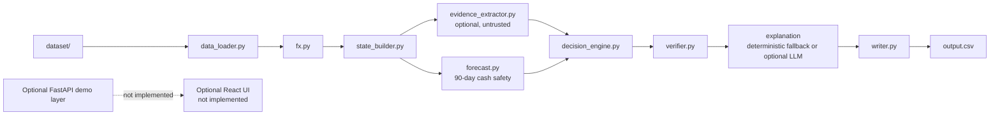

# Buy or Wait — Deterministic AI Financial Affordability Engine

> **A trustworthy financial decision engine for HackerRank Orchestrate — September 2026**

This repository implements the **Buy or Wait?** challenge for HackerRank Orchestrate. For every purchase request, it reconstructs the user's financial position, projects cash safety for 90 days, and recommends full payment, partial payment, installments, waiting, or not proceeding.

## Problem statement

The agent must decide whether a requested payment is safe without relying on live banking, market data, or exchange-rate APIs. It reads the supplied profiles, financial events, dated exchange rates, payment options, messages, and images, then writes one deterministic prediction row per request to `output.csv`.

### Why a balance check is insufficient

The current balance alone does not show what the user can safely spend. A correct decision must reserve pending debits, exclude pending credits and unrealized investment value, account for recurring and essential expenses, count confirmed income on its settlement date, preserve the user's minimum balance, respect payment preferences, and complete the selected plan by the requested deadline.

## Solution overview

The production entry point is `code/main.py`. It:

1. Loads and validates the dataset.
2. Normalizes event amounts into each user's home currency.
3. Builds a dated cash-flow forecast.
4. Generates safe payment and spending-change candidates.
5. Ranks candidates using a fixed six-step ordering.
6. Verifies and atomically writes the contractual `output.csv`.

The default run is deterministic and needs no API key. If `ANTHROPIC_API_KEY` is supplied, optional image/message extraction and explanation generation can run through the cached Anthropic client; those calls never replace the safety rules.

## Architecture and data flow



The optional FastAPI and React boxes are explicitly not part of this repository's implemented runtime. There is no frontend, server, or browser UI to launch.

### Module responsibilities

| Module | Responsibility |
|---|---|
| `code/main.py` | Pipeline orchestration, optional evidence/explanation calls, output and usage-report generation |
| `code/config.py` | Repository-relative paths, environment loading, schema and allowed values |
| `code/data_loader.py` | CSV parsing, typed records, required-column and reference validation |
| `code/fx.py` | Fixed dated exchange-rate lookup and currency conversion |
| `code/state_builder.py` | Typed user-state view, pending-debit and category summaries |
| `code/evidence_extractor.py` | Optional Anthropic extraction from untrusted messages/images with cache support |
| `code/forecast.py` | Dated cash flows, supported recurrence projection, 90-day balance simulation, safe amount/date calculations |
| `code/decision_engine.py` | Candidate generation, spending-change combinations, safety filtering, ranking, and result fields |
| `code/verifier.py` | Decision-level consistency checks before writing |
| `code/writer.py` | Schema-locked validation and atomic CSV output |
| `code/llm_client.py` | Anthropic calls, cache keys, recorded usage, and cost calculation |

### Financial state reconstruction

Profiles provide home currency, current balance, minimum balance, protected categories, adjustable categories, payment preferences, and installment limits. Events are filtered to exclude cancelled/failed transactions and unrealized investments. Settled and scheduled cash flows use `settlement_date` when present; pending debits reserve cash, while pending credits are not counted. Historical cash flows before the request date are not applied again to the profile's current balance.

Recurring projection requires at least three observations with a stable cadence. The forecast preserves the minimum balance after every projected event and candidate payment.

### Currency normalization

`fx.py` uses only the supplied dated `exchange_rates.csv` rows. `main.py` converts event amounts to the user's home currency before constructing the forecast. There are no live exchange-rate or market-data calls.

### Untrusted evidence and prompt-injection defense

Messages and images are evidence, not instructions. The optional extractor is isolated behind the Anthropic API key and cache. Text embedded in evidence cannot change challenge rules, allowed output values, minimum-balance protection, payment-option constraints, or the candidate ranking. Missing evidence is not invented. The deterministic decision engine does not execute instructions found in messages or images.

## Candidate generation and ranking

For each request, the engine considers:

- full payment on the request date;
- waiting for the earliest safe full-payment date;
- exactly two-payment partial payment when the request and profile allow it;
- supplied installment options within the user's maximum installment limit; and
- up to three permitted changes to future flexible recurring events.

Every candidate is simulated against the 90-day forecast and discarded if the balance falls below the minimum or the plan misses the completion deadline.

The exact six-step ranking order is:

1. Complete by the requested deadline (`True` first).
2. Fewer spending changes.
3. Lower total amount paid.
4. Earlier first payment date.
5. Fewer payments.
6. Lowest payment-option ID.

`verifier.py` checks the result before `writer.py` validates the output schema, amount bounds, plan syntax, chronological dates, and partial-payment structure.

### Explanation generation

Without an API key, the engine writes a deterministic explanation such as `Recommended wait via deterministic decision rules.` or a safe-payment failure message. With an API key, `explanation_generator.py` may produce a grounded explanation from the selected decision. LLM failures fall back to the deterministic explanation; they do not change affordability or safety calculations.

## Dataset inputs

The runtime reads these participant-facing files from `dataset/`:

- `financial_profiles.csv`
- `financial_events.csv`
- `exchange_rates.csv`
- `requests.csv`
- `request_payment_options.csv`
- `messages.csv`
- `images.csv`
- `media/images/*.png`

`sample_requests.csv` is used only by the sample evaluator. `dataset/output.csv` is a blank reference template. The production pipeline reads `requests.csv` and does not use organizer-only files.

## Output schema

The root `output.csv` contains exactly these columns, in this order:

```text
request_id,amount_safe_to_pay,affordability_status,recommended_payment_method,payment_plan,earliest_date_for_full_payment,spending_changes_needed,decision_explanation
```

There is one row per production request. Allowed statuses are `affordable_now`, `affordable_with_plan`, `affordable_later`, and `not_affordable`. Allowed methods are `full_payment`, `partial_payment`, `installments`, `wait`, and `not_recommended`.

## Evaluation and accounting

Run the solved-example evaluator with:

```bash
python3 evaluation/score_samples.py
```

It runs the unchanged production pipeline against the 25 rows in `dataset/sample_requests.csv`, compares numeric amounts with a `0.01` tolerance, compares dates using supported equivalent renderings, compares categorical/plan/change fields exactly, reports every mismatch, and groups likely root causes. Sample answers are never hardcoded into the engine.

The final full-dataset run writes `evaluation/usage_report.md`. It records provider/model, image/message/explanation call counts, total/input/output tokens, average tokens per request, and estimated cost. If the provider is unavailable, the report records zero calls/tokens/cost rather than fabricating values.

## Setup and run

Use Python 3. The implementation has no required live service for the deterministic path. Install test/runtime dependencies from `requirements.txt` in a virtual environment if needed:

```bash
python3 -m venv .venv
source .venv/bin/activate
python3 -m pip install -r requirements.txt
```

On Windows PowerShell, use `.venv\Scripts\Activate.ps1` and the equivalent `python` command if `python3` is not available.

The exact challenge run command is:

```bash
python3 code/main.py
```

This reads `dataset/requests.csv` and writes `output.csv` plus `evaluation/usage_report.md` at the repository root. It does not modify files under `dataset/`.

### Environment variables

Copy `.env.example` to `.env` only when optional Anthropic calls are desired. `.env` is ignored by Git.

| Variable | Purpose | Default |
|---|---|---|
| `ANTHROPIC_API_KEY` | Enables optional evidence extraction and explanation calls | unset |
| `LLM_MODEL` | Anthropic model name | `claude-opus-4-5` |
| `OUTPUT_DIR` | Alternate output directory | repository root |

Never commit `.env`, API keys, tokens, or credentials. The cache is local and ignored.

## Testing

Run the complete test suite:

```bash
pytest -q
```

The tests cover loading, FX, forecasts, decisions, evidence boundaries, verification, writing, pipeline reproducibility, and sample comparison.

## Privacy and security

The project uses only supplied dataset files and optional environment-provided credentials. It does not connect to banks, markets, or live FX services. Logs and caches are ignored where appropriate; `log.txt` is the chat transcript artifact and must not be committed. Scan source and generated text for credential patterns before submission, and do not include API keys in `output.csv`, usage reports, or archives.

## Reproducibility

The deterministic path fixes temperature at zero, uses dated input data, stable sorting/ranking, repository-relative paths, and atomic output writing. Re-running `python3 code/main.py` with the same inputs produces the same CSV bytes. Optional LLM calls use stable cache keys; cached responses are reused, and recorded provider usage is retained for accounting.

## Submission artifacts

Prepare these artifacts for HackerRank:

- `code.zip` — runnable source, prompts, tests, and `evaluation/` reports;
- `output.csv` — the completed 250-request prediction file; and
- `log.txt` — the separately submitted chat transcript.

Do not put `log.txt`, `.env`, caches, or secrets into Git or `code.zip` unless the submission instructions explicitly require the transcript separately.

## Prototype Screenshots

No frontend screenshots exist in this repository. The following captions are placeholders, not claims that images are present:

### Request Selector

`[Placeholder — no implemented UI screenshot]`

### Decision Result

`[Placeholder — no implemented UI screenshot]`

### 90-Day Forecast

`[Placeholder — no implemented UI screenshot]`

### Evidence Panel

`[Placeholder — no implemented UI screenshot]`

### Batch Run

`[Placeholder — no implemented UI screenshot]`

## Known limitations

- The default environment has no Anthropic key, so the committed production output uses deterministic fallback explanations and no provider calls.
- Optional evidence extraction exists, but the production safety decision remains governed by structured deterministic rules; extracted evidence is not a substitute for explicit dataset records.
- Linked-event/amendment reconciliation across all message/image cases is not complete.
- The repository contains no implemented FastAPI service or React frontend.
- Sample evaluation is calibration evidence, not hidden-label training; remaining sample mismatches are documented in `evaluation/sample_score_report.md`.

## Future improvements

- Add a general linked-event and amendment reconciliation layer.
- Integrate validated evidence facts into state reconstruction with explicit provenance.
- Add a small FastAPI read-only demo API and a React review UI.
- Improve conservative recurrence and installment candidate modeling while preserving safety invariants.
- Add richer structured usage aggregation for multi-model runs.

## AI Judge interview talking points

- **Trust:** safety is enforced by deterministic simulation and verification, not by an LLM's prose.
- **Personalization:** the same purchase can produce different decisions because profiles, commitments, preferences, currencies, and minimum balances differ.
- **Financial safety:** pending debits are reserved, pending credits are excluded, and every candidate is checked across 91 forecast days.
- **Explainability:** every output includes the selected method, plan, date, and concise rationale.
- **LLM boundary:** models may extract untrusted evidence or phrase explanations; they cannot override challenge rules or authorize unsafe payments.
- **Reproducibility:** fixed dated inputs, stable ranking, cache keys, and schema-locked atomic output make reruns auditable.
- **Evaluation discipline:** sample scoring reports exact field mismatches and root-cause clusters without hardcoding solved answers.
